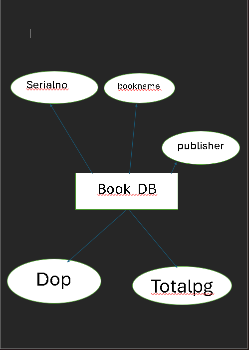

# Ex02 Django ORM Web Application
## Date: 

## AIM
To develop a Django application to store and retrieve data from a Book database using Object Relational Mapping(ORM).

## Entity Relationship Diagram



## DESIGN STEPS

### STEP 1:
Clone the problem from GitHub

### STEP 2:
Create a new app in Django project

### STEP 3:
Enter the code for admin.py and models.py

### STEP 4:
Execute Django admin and create details for 10 books

## PROGRAM
```
admin.py
from django.contrib import admin
from .models import Book_DB,Book_DBAdmin
admin.site.register(Book_DB,Book_DBAdmin)

models.py
from django.db import models
from django.contrib import admin
class Book_DB(models.Model):
     serialno=models.IntegerField(primary_key="serialno");
     bookname=models.CharField(max_length=20);
     publisher=models.CharField(max_length=20);
     Dop=models.DateField();
     totalpg=models.IntegerField();
class Book_DBAdmin(admin.ModelAdmin):
     list_display=("serialno","bookname","publisher","Dop","totalpg");
```
## OUTPUT


## RESULT
Thus the program for creating a database using ORM hass been executed successfully
